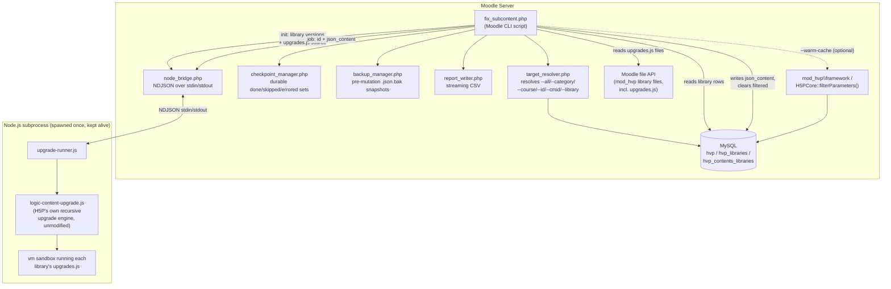
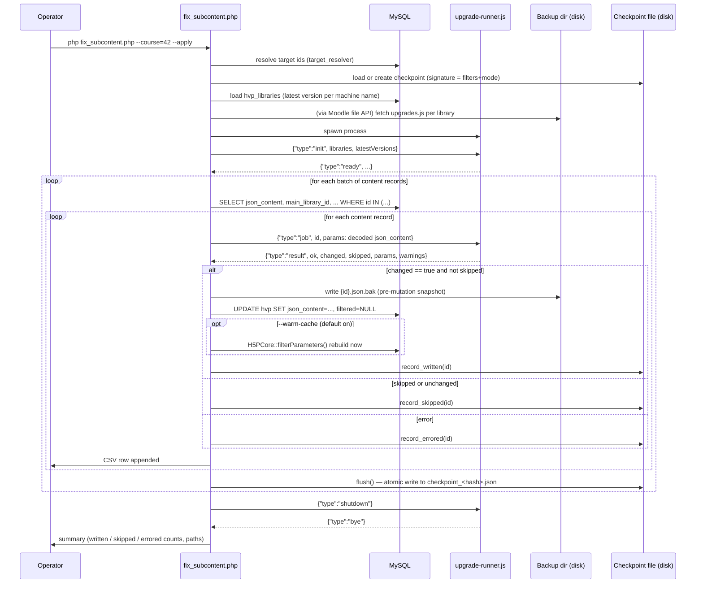
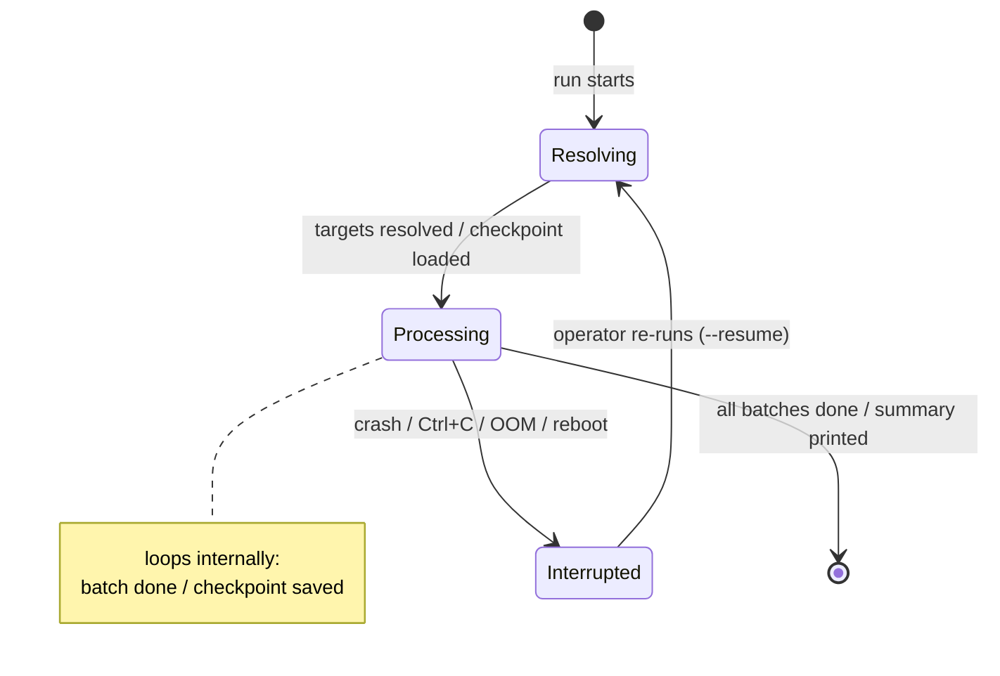

# mod_hvp `fix_subcontent` CLI — Operations Manual

A headless, resumable, checkpointed command-line equivalent of
`/mod/hvp/library_list.php?fix_subcontent=1`, for repairing the mod_hvp
1.28.2 subcontent version-lock defect.

Built for: Moodle 4.5.12 (2024100712), Ubuntu 24.04 LTS, PHP 8.3.32, MySQL
8.0.46, mod_hvp 1.28.4+.

**NO GUARANTEES - `Experimental`**

Tracks: [h5p/moodle-mod_hvp#632](https://github.com/h5p/moodle-mod_hvp/issues/632) ·
[#633](https://github.com/h5p/moodle-mod_hvp/pull/633) ·
[#642](https://github.com/h5p/moodle-mod_hvp/pull/642) ·
[#660](https://github.com/h5p/moodle-mod_hvp/issues/660)

---

## Table of contents

1. [What this actually fixes](#1-what-this-actually-fixes)
2. [Architecture](#2-architecture)
3. [Prerequisites](#3-prerequisites)
4. [Installation](#4-installation)
5. [Quick start](#5-quick-start)
6. [Command reference](#6-command-reference)
7. [Dry run vs. live run](#7-dry-run-vs-live-run)
8. [Checkpoint / resume engine](#8-checkpoint--resume-engine)
9. [Backups and disaster recovery](#9-backups-and-disaster-recovery)
10. [Worked examples by content type](#10-worked-examples-by-content-type)
11. [Logs and CSV reports](#11-logs-and-csv-reports)
12. [Performance guidance for large sites](#12-performance-guidance-for-large-sites)
13. [Known limitations](#13-known-limitations)
14. [Troubleshooting](#14-troubleshooting)
15. [Test coverage of this build](#15-test-coverage-of-this-build)

---

## 1. What this actually fixes

When mod_hvp was upgraded to 1.28.2, a code change ([commit `d16c4c0`](https://github.com/h5p/moodle-mod_hvp/pull/633),
HFP-4358) dropped the `semantics` property that the content-upgrade pipeline
needs when it walks a content type's parameter tree. The practical effect,
confirmed independently by multiple reporters in issue #632: running the
**normal library-upgrade** for a container content type (Column/Page,
InteractiveBook, InteractiveVideo, BranchingScenario, QuestionSet, ...)
bumped that container's own `main_library_id` to the new version, but did
**not** recurse into its embedded sub-content and upgrade *their* library
references. Symptom in the Moodle UI:

> The version of the H5P library H5P.Column used in this content is not
> valid. Content contains H5P.Column 1.18, but it should be H5P.Column 1.22.

PR #633 fixed the root cause going forward. PR #642 added a **browser-based**
repair mechanism — `/mod/hvp/library_list.php?fix_subcontent=1` — that
re-runs the upgrade pipeline for already-upgraded content, this time
correctly walking into subcontent. Issue #660 (this tool) exists because
that browser tool is impractical at scale: it runs client-side in a Web
Worker tied to one browser tab, has no server-side job, and had no way to
resume after an interruption — documented in #660 as 7+ hours to process
12,229 Course Presentation instances, killed by session timeouts and
scheduled reboots before completion.

**This CLI does the same repair — re-walk every piece of subcontent and
bump any stale nested library reference to the latest installed version,
running that library's `upgrades.js` hooks along the way — but:**

- Runs headless from `php` / cron / a scheduled task, no browser needed.
- Can be scoped to a category, course, activity, or single content type.
- Checkpoints progress to disk so an interrupted run resumes instead of
  restarting.
- Writes a pre-mutation backup of every record it touches, with a
  one-command restore path.
- Produces a CSV audit trail per run.

**What it deliberately does NOT do:** repair content where the upgrade
already destructively wiped a sub-content block to `{"params":{}}` with no
`library` key (the "data-loss" pattern some #632 commenters found). That
pattern has no library reference left to recurse from — the fix for those
records is restoring `json_content` from a backup taken *before* the
original 1.28.2-triggered upgrade ran, not this tool. See
[§13 Known limitations](#13-known-limitations).

---

## 2. Architecture

### 2.1 Component overview



### 2.2 Why a persistent Node subprocess, not one-shot per item

Issue #660's own numbers make the case: Course Presentation alone had
12,229 instances on that site. Spawning a fresh Node process per content
item adds fork/exec + V8 startup + re-parsing every `upgrades.js` on every
single call — at even 20-30ms overhead that is minutes of pure waste before
any real work happens, and it gets worse for the busier libraries reporters
listed in #660 (Question Set: 5,885; Interactive Book: 3,601; Interactive
Video: 2,696; Fill in the Blanks: 2,850; ...). This design spawns Node
**once**, sends it every installed library's latest version and
`upgrades.js` source **once** via an `init` message, then streams one `job`
message per content record over the already-open pipe. Node startup and
script compilation cost is paid exactly once per run, not once per record.

### 2.3 Why the upgrade logic runs in Node, not a PHP port

H5P content types ship their upgrade hooks (`upgrades.js`) as JavaScript —
that's true for every H5P integration (Moodle, WordPress, Drupal...), not
just this one, and is confirmed by `otacke` and `icc` in the #660 thread:
porting that logic to PHP would mean re-implementing and keeping in sync
potentially hundreds of third-party upgrade scripts, most of which this
project doesn't control. Running the *actual* `upgrades.js` files that ship
with each library, unmodified, in a real JS engine (Node's V8) is the only
way to guarantee the CLI produces byte-identical results to the browser
tool. `logic-content-upgrade.js` in this package is H5P's own reusable
traversal engine (the same one `h5p-cli` uses) — see `otacke`'s comment
linking to it in #660 — used here verbatim.

### 2.4 Why PHP owns the database and Node never touches it

Node is stateless and untrusted-input-safe by construction: it receives a
parameter tree, returns an upgraded parameter tree (or an error), and never
sees a database credential, a file path outside its own `runner/` folder,
or Moodle's config. All storage, auth, file access, and transactional
integrity stay in PHP, using Moodle's own `$DB` API and file storage layer
— exactly the "reusable JavaScript runner" / "Moodle background
orchestration" split `PM84` proposed in the #660 thread, and the design
`otacke` confirmed is "quite simple, purely data structure transforming"
JavaScript with no inherent need for database or filesystem access.

### 2.5 Why subcontent detection doesn't need `semantics.json`

The browser tool's original bug (#632/#633) stemmed from a semantics-driven
traversal that broke when the `semantics` property went missing. This CLI's
core module (`logic-content-upgrade.js`) sidesteps that entire failure mode:
it recurses through the parameter tree looking for the **structural shape**
every embedded H5P sub-content has — an object with both a `library` string
field and a `params` object field — rather than needing a parsed
`semantics.json` to know where sub-content *should* live. This is more
robust (no dependency on a possibly-missing semantics definition) and,
importantly, it naturally never touches the **root** content's own library
reference, because `hvp.json_content` in the database is *already* the root
library's `params` — it isn't wrapped in an outer `{library, params}`
object the way sub-content is. That's exactly `fix_subcontent=1`
semantics: subcontent gets fixed, the root's `main_library_id` is left
alone.

### 2.6 Sequence diagram — one `--apply` run



### 2.7 NDJSON wire protocol

Every message is one line of JSON terminated by `\n`. PHP never sends the
next message until it has read a full response line for the previous one
(strictly synchronous request/response over the pipe) — this keeps the
protocol trivial to reason about and debug; parallelism across content
items is a batching/process-pool concern for a future version (see
[§12](#12-performance-guidance-for-large-sites)), not something this
protocol needs to solve today.

| Direction | Type | Payload |
|---|---|---|
| PHP → Node | `init` | `latestVersions` (machine name → `{major,minor,patch}`), `libraries` (machine name → `{upgradeScript}`) |
| Node → PHP | `ready` | `librariesKnown`, `upgradeScriptsLoaded`, `nodeVersion` |
| PHP → Node | `job` | `id`, `params` (decoded `json_content`) |
| Node → PHP | `result` | `id`, `ok`, `changed`, `skipped`, `skippedReason`, `params`, `warnings`, `error` |
| PHP → Node | `shutdown` | — |
| Node → PHP | `bye` | — |

A `result` with `skipped: true` means the record contains a reference to a
sub-content library that isn't installed on this server. Rather than write
back a corrupted version string (which the engine used to do until this was
caught during testing — see [§15](#15-test-coverage-of-this-build)), the
whole record is left untouched and flagged for manual review.

### 2.8 Concurrency safeguards

Raised directly in the #660 thread by `PM84`: *"Concurrent editing and
duplicate execution need explicit safeguards."* Two distinct risks, two
distinct mechanisms:

**Duplicate execution** — two invocations of the *same logical command*
(same target filters + mode, e.g. two operators both running
`--all --library=H5P.CoursePresentation --apply`, or an overlapping cron
double-fire) racing each other against the same records. Guarded by an
exclusive, non-blocking `flock()` taken on a `.lock` file next to the
checkpoint (same signature-derived name, so it's specific to *this exact
command*, not a global site-wide lock) the moment target resolution and
checkpoint loading finish, held for the process's lifetime, and released
automatically on exit — including a crash, since the OS releases `flock()`
handles when a process dies. A second instance of the same command is
refused outright with a clear error rather than silently racing:

```
Another instance of this exact command (same target filters + mode) appears to
already be running - refusing to start a second one against the same records.
```

**Concurrent editing** — a teacher opens the H5P editor and saves a change
to one specific activity while a long run (which can take hours across a
large library — see #660's own 12,229-instance example) is midway through
processing it. Guarded by a check-then-act comparison immediately before
each write: the batch `SELECT` that loaded a record also captures its
`timemodified`; right before writing, that column is re-read and compared.
If it moved, someone/something else changed this exact record more
recently than the parameter tree this run upgraded, so the write is
skipped rather than silently overwriting their edit — the id is marked
`errored` in the checkpoint (so a later `--resume` naturally re-reads and
re-upgrades the *current* content, not the stale copy) and the CSV records
`status=skipped-concurrent-edit`.

This is a narrowing, not an elimination, of the race window — Moodle's
`$DB` API has no portable "`UPDATE ... WHERE timemodified = :x`, tell me
if a row actually matched" primitive to close it completely in one atomic
statement across all supported DB drivers. In practice the window between
the re-check and the `UPDATE` is a single PHP statement, which is a very
different risk profile from the unconditional overwrite this tool started
with before the check was added.

---

## 3. Prerequisites

| Requirement | Why | Verify with |
|---|---|---|
| Moodle 4.5.x with mod_hvp 1.28.4+ installed | This tool assumes the schema and `H5PCore` methods shipped in that version; #642's server-side fix must be present | Site administration → Plugins → mod_hvp version |
| PHP 8.3 CLI, with `mysqli`/`pdo_mysql` (whatever Moodle already uses) | Runs as a standard Moodle admin/CLI script | `php --version` |
| **Node.js ≥ 18** on the *same server* (or reachable via `--node-path`) | Executes the real `upgrades.js` hooks — see [§2.3](#23-why-the-upgrade-logic-runs-in-node-not-a-php-port) | `node --version` |
| Shell access to run `php` CLI scripts | Standard for any Moodle `admin/cli`-style script | — |
| Write access to `$CFG->dataroot` | Backups, checkpoints, logs, CSV reports all live under `{dataroot}/hvp_fix_subcontent/` by default | — |
| A recent full backup (DB + `moodledata`) taken **before** your first `--apply` run | This tool's own backups only cover records it touches *during* a run — they are not a substitute for your normal backup regime | Your existing backup process |

Node.js is an **optional dependency of this CLI tool only** — it does not
make Node a Moodle-wide requirement. Nothing else in Moodle or mod_hvp
needs it; only this script does, and only for the duration of a run.

---

## 4. Installation

1. **Copy the `cli/` directory into your mod_hvp plugin**, so the final
   layout is:

   ```
   {moodle root}/mod/hvp/cli/fix_subcontent.php
   {moodle root}/mod/hvp/cli/classes/*.php
   {moodle root}/mod/hvp/cli/runner/upgrade-runner.js
   {moodle root}/mod/hvp/cli/runner/logic-content-upgrade.js
   {moodle root}/mod/hvp/cli/runner/selftest.js
   {moodle root}/mod/hvp/cli/runner/package.json
   ```

   ```bash
   cd /path/to/moodle/mod/hvp
   # from the extracted download of this package:
   cp -r /path/to/downloaded/mod/hvp/cli ./cli
   ```

2. **Verify Node.js is installed and reachable:**

   ```bash
   node --version   # expect v18.x or newer
   ```

   If Node isn't installed and your distro's package manager can't reach
   the internet directly, install it via your organisation's usual
   approved channel (NodeSource repo, snap, manually downloaded tarball,
   etc.) — this tool has no opinion on how Node gets onto the box, only
   that `node` (or the path you pass via `--node-path`) works.

3. **Run the standalone Node self-test** (no Moodle/DB required — confirms
   the runner subprocess and NDJSON protocol work on this exact server):

   ```bash
   cd /path/to/moodle/mod/hvp/cli/runner
   node selftest.js
   ```

   Expected final line: `SELFTEST PASSED - upgrade-runner.js is working
   correctly.` If this fails, fix it before going any further — nothing
   else in this tool can work if the runner itself doesn't.

4. **Confirm the PHP CLI script bootstraps correctly** with a read-only,
   zero-risk command:

   ```bash
   cd /path/to/moodle
   php mod/hvp/cli/fix_subcontent.php --list-libraries
   ```

   This queries `hvp_libraries`, reports which installed libraries have an
   `upgrades.js`, and counts content whose **root** library is stale (a
   quick sanity check that DB/file-storage access works) — it makes no
   writes and never touches Node.

5. **File permissions:** the directories this tool creates under
   `$CFG->dataroot/hvp_fix_subcontent/` (backups, checkpoints, logs,
   reports) are created with mode `0770`, owned by whatever user runs the
   `php` CLI command — normally the same user/group Moodle's cron already
   runs as. No special configuration is needed beyond that user having
   write access to `dataroot`, which it already does.

No Composer packages and no `npm install` are required — the Node runner
uses only Node's built-in `vm` and `readline` modules (see
`runner/package.json`).

---

## 5. Quick start

```bash
cd /path/to/moodle

# 1) Audit only - no changes, confirms the tool can see your data:
php mod/hvp/cli/fix_subcontent.php --list-libraries

# 2) Pilot on one course, dry-run (the default mode - makes NO changes):
php mod/hvp/cli/fix_subcontent.php --course=42 --dry-run

# 3) Happy with the preview? Apply it for real, to that same course:
php mod/hvp/cli/fix_subcontent.php --course=42 --apply

# 4) Confirm in the Moodle UI that the activities in course 42 now render
#    without the "library used in this content is not valid" banner.

# 5) Roll out site-wide, one content type at a time (see #12-guidance-for-large-sites for why):
php mod/hvp/cli/fix_subcontent.php --all --library=H5P.CoursePresentation \
    --apply --resume --batch-size=500
```

If step 5 is interrupted for any reason (Ctrl+C, SSH drop, server reboot,
OOM kill), just run the **exact same command again** — `--resume` picks up
from the checkpoint automatically.

---

## 6. Command reference

```
php mod/hvp/cli/fix_subcontent.php <target> [<mode>] [options]
```

### Target (exactly one required, unless `--list-libraries` / `--restore-run`)

| Option | Meaning |
|---|---|
| `--all` | Every H5P activity on the site. |
| `--category=<id>[,<id>...]` | All courses in these categories, **including subcategories**. |
| `--course=<id>[,<id>...]` | These specific courses. |
| `--id=<hvpid>[,<hvpid>...]` | Specific `hvp` table row id(s) — the activity's *instance* id. |
| `--cmid=<cmid>[,<cmid>...]` | Specific `course_modules.id` value(s) — the id in the activity's view URL, `.../mod/hvp/view.php?id=CMID`. |
| `--library=<machinename>` | Narrows *any* of the above to content whose **root** content type matches, e.g. `H5P.InteractiveBook`. Matches **any installed version** of that machine name. Combine freely with the others. Mutually exclusive with `--libraryid`. |
| `--libraryid=<id>[,<id>...]` | Narrows *any* of the above to content whose **root** content type is exactly this `hvp_libraries.id` row — one specific machine name **and** version, not just any version of that name. Safer than `--library` when more than one version of the same content type is installed side by side and you want to pin exactly one. Look the id up via `--list-libraries` or a direct query against `hvp_libraries`. Combine freely with the others. Mutually exclusive with `--library`. |

Multiple target filters in one command are **unioned** together (e.g.
`--id=4 --course=100` processes id 4 plus everything in course 100).
`--library` and `--libraryid` are the exception — they're mutually exclusive
narrowing filters, not unioned targets; the tool errors out if you pass both.

### Mode (default: dry-run)

| Option | Meaning |
|---|---|
| `--dry-run` | Report what would change. **Makes no database writes.** This is the default if you pass neither flag. |
| `--apply` | Actually write the fix to the database. |

### Resume / checkpointing

| Option | Meaning |
|---|---|
| `--resume` | Skip ids already completed by a previous run of this *exact* command (matched by a hash of your target + mode options — see [§8](#8-checkpoint--resume-engine)). |
| `--clear-checkpoint` | Discard any existing checkpoint for this command and start fresh. |
| `--checkpoint-dir=<path>` | Default `{dataroot}/hvp_fix_subcontent/checkpoints`. |
| `--checkpoint-file=<path>` | Use an exact checkpoint file path instead of the auto-derived one. |

### Backup / recovery

| Option | Meaning |
|---|---|
| `--backup-dir=<path>` | Default `{dataroot}/hvp_fix_subcontent/backups`. |
| `--restore-run=<runid>` | Restore every record backed up during a previous `--apply` run (the run id is printed at the end of that run, and appears in the backup directory name). |
| `--restore-id=<id>[,<id>...]` | Narrow `--restore-run` to specific `hvp` ids. |

### Reporting

| Option | Meaning |
|---|---|
| `--log-file=<path>` | Default `{dataroot}/hvp_fix_subcontent/logs/fix_subcontent_<timestamp>.log`. |
| `--csv=<path>` | Default `{dataroot}/hvp_fix_subcontent/reports/fix_subcontent_<timestamp>.csv`. |
| `--list-libraries` | Read-only audit (see [§4 step 4](#4-installation)). Ignores target/mode options. |

### Performance / safety

| Option | Meaning |
|---|---|
| `--batch-size=<n>` | Content records fetched from the DB per batch (default 200). |
| `--max-content=<n>` | Stop after N content records (`0` = unlimited). Useful for a small pilot before a site-wide run. |
| `--node-path=<path>` | Path to the `node` binary (default `node`). |
| `--node-timeout=<seconds>` | Per-item timeout waiting on the Node runner (default 30). |
| `--warm-cache=1\|0` | Immediately rebuild Moodle's filtered-params cache and library-dependency rows after each fix (default `1`/on). See [§2](#2-architecture) sequence diagram. |
| `--yes` | Skip the interactive confirmation prompt before a large `--apply` run (>50 records) or a `--restore-run`. Needed for unattended/cron use. |

Run `php mod/hvp/cli/fix_subcontent.php --help` at any time for this same
reference plus copy-pasteable examples.

---

## 7. Dry run vs. live run

**Dry run** (`--dry-run`, or simply omitting `--apply`) exercises the
*entire* pipeline — target resolution, library/version loading, spawning
Node, running every upgrade hook on every matched record — and reports
exactly what *would* happen, but stops before the database write. This
means a dry run is a completely trustworthy preview: if it says a record
would change, an `--apply` run against the same target will make that exact
change (barring content edited by a user in between).

```bash
php mod/hvp/cli/fix_subcontent.php --course=42 --dry-run
```

```
[info] Neither --apply nor --dry-run given - defaulting to --dry-run (no changes will be made).
[2026-09-21T10:02:11+00:00] fix_subcontent CLI starting. run_id=run_20260921_100211_a1b2c3 mode=DRY-RUN
[2026-09-21T10:02:11+00:00] Resolved 14 target content record(s).
[2026-09-21T10:02:12+00:00] Loaded 87 installed library version(s), 41 with an upgrades.js.
[2026-09-21T10:02:12+00:00] Node runner ready: {"type":"ready","librariesKnown":87,"upgradeScriptsLoaded":41,"nodeVersion":"v20.11.0"}
[2026-09-21T10:02:12+00:00] Beginning processing: 14 id(s) in 1 batch(es) of up to 200.
[2026-09-21T10:02:12+00:00] --- Batch 1/1 (14 item(s)) ---
[2026-09-21T10:02:12+00:00] [DRY]   id 501 (Fruits, H5P.InteractiveBook 1.15): would upgrade subcontent
[2026-09-21T10:02:12+00:00] [DRY]   id 502 (Vegetables, H5P.InteractiveBook 1.15): would upgrade subcontent
...
[2026-09-21T10:02:13+00:00] === RUN COMPLETE ===
[2026-09-21T10:02:13+00:00] Mode: DRY-RUN (no changes made)
[2026-09-21T10:02:13+00:00] Written:      0
[2026-09-21T10:02:13+00:00] Would-write:  11 (dry-run only)
[2026-09-21T10:02:13+00:00] Skipped:      3 (already correct, or unresolvable - see warnings)
[2026-09-21T10:02:13+00:00] Errored:      0 (see log/CSV, safe to --resume and retry)
```

**Live run** (`--apply`) does everything a dry run does, **plus**: writes a
`.json.bak` backup before touching each record, performs the `UPDATE`,
optionally warms the cache, and records progress in the checkpoint. If the
target set is larger than 50 records, you'll be asked to type `yes` to
confirm (skip this with `--yes` for unattended/cron use).

```bash
php mod/hvp/cli/fix_subcontent.php --course=42 --apply
```

```
You are about to APPLY changes to 14 content record(s).
A pre-mutation backup will be written to: /var/www/moodledata/hvp_fix_subcontent/backups/run_20260921_100340_d4e5f6/
Type 'yes' to continue, anything else to abort:
yes
...
[2026-09-21T10:03:41+00:00] [FIXED] id 501 (Fruits, H5P.InteractiveBook 1.15)
[2026-09-21T10:03:41+00:00] [FIXED] id 502 (Vegetables, H5P.InteractiveBook 1.15)
...
[2026-09-21T10:03:44+00:00] === RUN COMPLETE ===
[2026-09-21T10:03:44+00:00] Mode: APPLY
[2026-09-21T10:03:44+00:00] Written:      11
[2026-09-21T10:03:44+00:00] Skipped:      3
[2026-09-21T10:03:44+00:00] Errored:      0
[2026-09-21T10:03:44+00:00] Backups:      /var/www/moodledata/hvp_fix_subcontent/backups/run_20260921_100340_d4e5f6
[2026-09-21T10:03:44+00:00] Checkpoint:   /var/www/moodledata/hvp_fix_subcontent/checkpoints/checkpoint_9f2a1b7c3d4e5f60.json (safe to delete with --clear-checkpoint)
```

---

## 8. Checkpoint / resume engine

**Design goal (directly from the #660/#642 discussion):** a single "last
completed id" cursor is not reliable once you consider that ids aren't
necessarily processed in increasing order (filters like `--course` +
`--library` don't guarantee that), and a future parallelised version of
this tool could finish ids out of order entirely. So instead of a cursor,
the checkpoint file tracks an explicit **set** of ids in three buckets:

- `written` — successfully upgraded (or, in dry-run, would have been).
- `skipped` — already correct, or contains an unresolvable library
  reference that was intentionally left alone.
- `errored` — failed for some other reason (bad JSON, Node timeout, DB
  write failure, ...) and **will be retried** on the next `--resume`.

The checkpoint file is named `checkpoint_<16-hex-char-hash>.json`, where the
hash is derived from your target filters **and** mode (dry-run vs apply).
This means:

- Re-running the *exact same command* with `--resume` finds the right
  file automatically.
- A dry-run and a live-run of the same target get **separate**
  checkpoints, so previewing something never marks it "done" for the real
  run.
- Two genuinely different commands (different course, different library
  filter, etc.) never collide or share progress.





**To resume an interrupted run**, just re-run the identical command with
`--resume` appended:

```bash
php mod/hvp/cli/fix_subcontent.php --all --library=H5P.CoursePresentation --apply --resume
```

Ids already in the `written` or `skipped` buckets are excluded from the
target list before processing starts; anything in `errored` is retried.

**When you're done for good** (a full run completed with zero `errored`
entries), the tool tells you the checkpoint is safe to delete:

```bash
php mod/hvp/cli/fix_subcontent.php --all --library=H5P.CoursePresentation --apply --clear-checkpoint
```

(Only pass `--clear-checkpoint` once you're confident you won't need to
resume — it discards all progress tracking for that command signature.)

---

## 9. Backups and disaster recovery

Every `--apply` run creates a directory:

```
{backup-dir}/{runid}/{hvp_id}.json.bak
```

Each `.json.bak` is a small JSON file containing exactly the fields needed
to fully restore that one row: `json_content`, `main_library_id`,
`filtered`, `timemodified`, plus when/which run took the snapshot. Within a
single run, a given id is backed up **only once** — if `--resume` retries an
id, the *original* pre-run snapshot is preserved, not whatever partial
state an earlier interrupted attempt left behind.

**To roll an entire run back:**

```bash
php mod/hvp/cli/fix_subcontent.php --restore-run=run_20260921_100340_d4e5f6
```

```
About to RESTORE 11 content record(s) from backup run 'run_20260921_100340_d4e5f6'.
This will overwrite the CURRENT json_content/main_library_id/filtered with the
pre-mutation snapshot taken before that run modified them.
Type 'yes' to continue, anything else to abort:
yes
[RESTORED] id 501 (backed up 2026-09-21T10:03:41+00:00)
[RESTORED] id 502 (backed up 2026-09-21T10:03:41+00:00)
...
Done. Restored 11/11 record(s).
Remember to purge caches afterwards: php admin/cli/purge_caches.php
```

**To restore just one or two specific records** from a run:

```bash
php mod/hvp/cli/fix_subcontent.php --restore-run=run_20260921_100340_d4e5f6 --restore-id=501,502
```

**This tool's backups are a safety net for its own changes, not a
substitute for your site's normal backup process.** Before your first
`--apply` run on production, take a full database backup as you normally
would — these `.json.bak` files only ever cover records this specific tool
touched during a specific run.

---

## 10. Worked examples by content type

Pilot each content type individually before a full site-wide sweep — see
[§12](#12-performance-guidance-for-large-sites) for why doing it this way
(rather than one giant `--all` run) matters at scale.

```bash
# Course Presentation - the largest library in most #660-style reports
php mod/hvp/cli/fix_subcontent.php --all --library=H5P.CoursePresentation --dry-run
php mod/hvp/cli/fix_subcontent.php --all --library=H5P.CoursePresentation --apply --resume --batch-size=500

# Interactive Book
php mod/hvp/cli/fix_subcontent.php --all --library=H5P.InteractiveBook --dry-run
php mod/hvp/cli/fix_subcontent.php --all --library=H5P.InteractiveBook --apply --resume

# Branching Scenario
php mod/hvp/cli/fix_subcontent.php --all --library=H5P.BranchingScenario --dry-run
php mod/hvp/cli/fix_subcontent.php --all --library=H5P.BranchingScenario --apply --resume

# Column / Page (the library at the centre of the original #632 report)
php mod/hvp/cli/fix_subcontent.php --all --library=H5P.Column --dry-run
php mod/hvp/cli/fix_subcontent.php --all --library=H5P.Column --apply --resume

# Question Set
php mod/hvp/cli/fix_subcontent.php --all --library=H5P.QuestionSet --dry-run
php mod/hvp/cli/fix_subcontent.php --all --library=H5P.QuestionSet --apply --resume

# Interactive Video
php mod/hvp/cli/fix_subcontent.php --all --library=H5P.InteractiveVideo --dry-run
php mod/hvp/cli/fix_subcontent.php --all --library=H5P.InteractiveVideo --apply --resume

# One course only, every content type in it
php mod/hvp/cli/fix_subcontent.php --course=42 --apply

# One specific activity, by its course_modules id (the "id" in the view.php URL)
php mod/hvp/cli/fix_subcontent.php --cmid=8842 --apply --yes

# A whole faculty's category tree, dry-run first
php mod/hvp/cli/fix_subcontent.php --category=17 --dry-run

# Pin one EXACT installed version with --libraryid instead of --library, when
# more than one version of a content type is installed side by side and you
# want to target only one of them precisely (find the id via --list-libraries
# or a direct SELECT against hvp_libraries):
php mod/hvp/cli/fix_subcontent.php --all --libraryid=42 --dry-run
php mod/hvp/cli/fix_subcontent.php --all --libraryid=42 --apply --resume
```

---

## 11. Logs and CSV reports

**Log file** (`{dataroot}/hvp_fix_subcontent/logs/fix_subcontent_<ts>.log`):
a timestamped, human-readable line per event — every content record's
outcome, every batch checkpoint flush, and the final summary. Same content
streams to the console.

**CSV report** (`{dataroot}/hvp_fix_subcontent/reports/fix_subcontent_<ts>.csv`):
one row per content record, written as it's processed (so a report from an
interrupted run is still useful), with columns:

| Column | Meaning |
|---|---|
| `hvp_id` | The `hvp` table primary key. |
| `course_id` | Course id. |
| `name` | Activity name. |
| `root_library` | The activity's own (root) content type and version, e.g. `H5P.InteractiveBook 1.15`. |
| `status` | `written` \| `would-write` (dry-run) \| `skipped` \| `error`. |
| `changed` | `yes`/`no` — did the subcontent tree actually differ after upgrading. |
| `warnings` | Any non-fatal notes (e.g. an unresolvable nested library reference). |
| `error` | Error detail, if `status` is `error`. |
| `timestamp` | ISO-8601 timestamp the row was written. |

This CSV is intentionally self-contained — attach it directly to a change
request without needing to cross-reference the log file.

---

## 12. Performance guidance for large sites

- **Go one content-library at a time with `--library=...`**, not one giant
  `--all` run. This matches the exact numbers reported in #660
  (Accordion 2,279 / Audio Recorder 2,087 / Branching Scenario 992 /
  Course Presentation 12,229 / Drag and Drop 1,891 / Fill in the Blanks
  2,850 / Flashcards 1,078 / Image Hotspots 880 / Interactive Book 3,601 /
  Interactive Video 2,696 / Page 1,188 / Question Set 5,885 / Speak the
  Words Set 1,958) and lets you checkpoint/resume/report per content type
  independently, rather than one all-or-nothing multi-hour run.
- **Pilot with `--max-content=25`** before committing to a full library
  sweep, so you can eyeball a handful of results (CSV + spot-check in the
  Moodle UI) before scaling up.
- **`--batch-size`** controls DB round-trips, not Node throughput — raising
  it (e.g. `500`) reduces query overhead on very large libraries; lowering
  it makes checkpoint flushes (and therefore safe interruption points) more
  frequent.
- **`--warm-cache=0`** skips the immediate `H5PCore::filterParameters()`
  rebuild after each write, trading "problems surface now, during your
  maintenance window" for "faster throughput, problems surface on next
  page view." For a first pass on an unfamiliar site, leave it on
  (default) so you find out about any residual issue immediately rather
  than from a support ticket.
- **Run unattended via `nohup`/`screen`/`tmux`/cron**, not an interactive
  browser session — this is the entire point of this tool versus the
  browser-based `fix_subcontent=1` page, which several #660/#632
  commenters documented being killed by idle timeouts, disconnects, and
  scheduled reboots on exactly this kind of long-running job:

  ```bash
  nohup php mod/hvp/cli/fix_subcontent.php --all --library=H5P.CoursePresentation \
      --apply --resume --batch-size=500 --yes \
      > /var/log/hvp_fix_subcontent_coursepresentation.out 2>&1 &
  ```

  If it's interrupted anyway, re-run the same command (still with
  `--resume`) — see [§8](#8-checkpoint--resume-engine).
- **True parallelism** (multiple concurrent Node workers processing
  disjoint id ranges) is not implemented in this version — the NDJSON
  protocol here is single-threaded/synchronous by design for simplicity
  and debuggability (see [§2.7](#27-ndjson-wire-protocol)). If your site's
  volume genuinely needs it, the natural extension is running multiple
  instances of this same script against non-overlapping `--id` ranges (or
  distinct `--library` values) concurrently, each with its own
  `--checkpoint-file` — the checkpoint/backup design (per-signature files,
  idempotent backups) was deliberately built to make that safe without any
  code changes, though you are responsible for ensuring your chosen ranges
  don't overlap.

---

## 13. Known limitations

- **Does not recover already data-lost content.** If a sub-content block
  was already reduced to `{"params":{}}` with no `library` key (the
  pattern `pliniopfp` documented in #632 — a nested block wiped to an empty
  shell during the original defective upgrade), there is no library
  reference left for this tool to recurse from. Recovery for those specific
  records requires restoring `json_content` from a backup taken *before*
  the original 1.28.2-triggered content upgrade ran (not a backup from this
  tool, which only starts protecting data from its own first run onward),
  then re-running this tool (or the browser `fix_subcontent=1` page) against
  the restored data. Use `--list-libraries` and your own DB backups to find
  candidates; this specific recovery path is inherently manual per #632's
  discussion thread.
- **Idempotent, not clairvoyant, about upgrade hooks.** This tool relies on
  each library's own `upgrades.js` being idempotent-safe to run multiple
  times where relevant — the same assumption PR #642's server-side fix
  makes, and the same one `otacke` and `icc` debated at length in #633's
  thread. It does not independently verify every third-party content
  type's upgrade hooks are side-effect-free on repeat application; if
  you've patched `#633` and are running mod_hvp ≥ 1.28.4, you are running
  the same upgrade pipeline this tool exercises.
- **Root library version is intentionally left untouched.** This mirrors
  `fix_subcontent=1` exactly — the assumption is your root content type is
  already at the correct version (you upgraded it through the normal
  Library Settings page) and only its *subcontent* was left behind. If a
  root library itself also needs upgrading, do that first through Moodle's
  normal Manage H5P Libraries page, then run this tool.
- **No parallel workers in this version** — see the end of
  [§12](#12-performance-guidance-for-large-sites).
- **Not the Moodle-adhoc-task dispatcher architecture `PM84` proposed in
  #660.** `PM84`'s review sketched a two-part design: a reusable JS runner
  (which this tool has — see [§2.3](#23-why-the-upgrade-logic-runs-in-node-not-a-php-port))
  plus a *Moodle background orchestration* layer that queues one
  `\core\task\adhoc_task` per activity, in bounded batches, with Moodle's
  own task-execution system providing configurable concurrency, retries,
  and task logs. This tool implements the first part faithfully but takes
  a simpler path for the second: a single long-running CLI process with
  its own batching/checkpoint/retry logic, rather than decomposing into
  Moodle's adhoc task queue. This matches what the user requesting this
  tool actually asked for (a CLI, mirroring issue #660's own literal
  proposed signature `php admin/cli/fix_h5p_subcontent.php --libraryid=<id>`)
  and is significantly simpler to reason about and test, but it means you
  don't get Moodle's own task-retry/concurrency machinery "for free" — this
  tool's checkpoint/lock/resume mechanisms (§§8, 2.8) are a deliberate,
  independently-built substitute for that, not a port of it. Migrating the
  same runner into an adhoc-task-based dispatcher later is possible without
  touching `runner/` at all, since `node_bridge.php` has no dependency on
  being called from a synchronous CLI script specifically.
- **No per-item CPU/time isolation inside the Node runner.** The `vm`
  sandbox each library's `upgrades.js` is evaluated into (see
  [§2.3](#23-why-the-upgrade-logic-runs-in-node-not-a-php-port)) does
  genuinely isolate upgrade hooks from the host's filesystem, network, and
  `require()` — no globals beyond a stub `console` are exposed to them —
  but that isolation only bounds *script evaluation* (`vm`'s `timeout`
  option applies to `runInContext()` calls made at `init` time). Once an
  upgrade hook is extracted as a plain function reference and later
  invoked per job, a single hung or infinite-looping third-party hook has
  no per-call timeout of its own; the only backstop is `node_bridge.php`'s
  coarse `--node-timeout` (default 30s), which treats an unresponsive
  runner as fatal for the *entire remaining run*, not just that one item.
  `PM84`'s review explicitly flagged "resource limits and isolation of
  server-side library JavaScript" as something the eventual design would
  need to address; true per-item preemption would require running each
  job in its own `worker_threads.Worker` (cheap relative to a full process
  spawn, but a real architectural change) so a hung job can be
  `.terminate()`'d individually. Not implemented in this version — if a
  specific third-party library's `upgrades.js` is known to be
  slow/unreliable, narrow your run to exclude it with `--library=...` and
  investigate that hook directly rather than relying on the timeout.
- **Single-server assumption.** Backups, checkpoints, and logs live on
  local disk (under `dataroot`, which is typically shared/networked in a
  Moodle cluster, but verify this for your environment before running
  against a load-balanced pool). The duplicate-execution lock (§2.8) is
  therefore also local-disk-based (`flock()`), which is sufficient for the
  common case of operators sharing one app server or a shared NFS-mounted
  `dataroot`, but won't detect a concurrent run against a `dataroot` that
  isn't actually shared across nodes.

---

## 14. Troubleshooting

| Symptom | Likely cause / fix |
|---|---|
| `Failed to spawn Node runner` | Node isn't installed or not on `PATH` for the user running this script. Run `node --version` as that same user; pass `--node-path=/full/path/to/node` if needed. |
| `Could not start the Node.js runner` mentions `selftest.js` | Run `node mod/hvp/cli/runner/selftest.js` directly — it isolates whether the problem is Node itself or something Moodle-specific. |
| A run reports many `skipped` with warning `references sub-content library machine name(s) not installed` | Those content records embed a library that isn't installed on this server (different from the root's own type). Install the missing content type via Moodle's H5P Hub / library upload, then re-run. |
| `error: json_content not valid JSON` | This record likely already suffered the data-loss pattern from #632, or its JSON is corrupt for an unrelated reason. Not fixable by this tool — see [§13](#13-known-limitations). |
| A checkpoint exists error on a run you thought was fresh | You (or a colleague) already ran this *exact* target+mode combination before. Pass `--resume` to continue it, or `--clear-checkpoint` if you're sure you want to discard that progress. |
| Content still shows the "not valid" banner after `--apply` | Confirm you ran `--apply` (not the default `--dry-run`); check the CSV `status` column for that id; if `warm-cache` was off, view the activity once in the browser to trigger the rebuild, or re-run with `--warm-cache=1`. |
| `Timed out ... waiting for Node runner response` | A single content item's upgrade hook likely hung (rare — usually a buggy third-party `upgrades.js`). Note the id from the log, investigate that specific library's upgrade script, and consider excluding that id with a narrower `--library`/`--id` filter while you investigate. Raise `--node-timeout` only if you have reason to believe it's simply slow, not stuck. |
| Need to undo an `--apply` run | `--restore-run=<runid>` — see [§9](#9-backups-and-disaster-recovery). |

---

## 15. Test coverage of this build

General note about what was and wasn't verified before this package was
developed (learning as I go)

- **`runner/upgrade-runner.js`** — exercised directly via
  `runner/selftest.js` (single-hook upgrade) and additional ad-hoc tests
  covering multi-level nesting (Column → Interactive Video), multi-step
  upgrade chains (two sequential hooks on one library), a library with no
  upgrade script at all (version string still bumped correctly), and the
  unresolved-library safety path (confirmed the whole record is now
  correctly withheld from write-back, after an initial version incorrectly
  wrote a corrupted `0.0` version string — caught and fixed during this
  build, not left for a production user to discover).
- **`classes/node_bridge.php`** — integration-tested against the real
  Node subprocess: init handshake, multiple sequential jobs, a
  deliberately malformed job (confirmed it reports an error rather than
  desyncing the protocol or crashing), and confirmed the bridge remains
  usable for further jobs after an error, plus clean shutdown.
- **`classes/checkpoint_manager.php`** — unit-tested: fresh-state
  creation, write/flush/reload round-trip, resume-after-simulated-crash
  (new instance, same signature, same directory), errored-ids excluded
  from "done" so they're retried, successful retry clearing the errored
  bucket, distinct signatures producing distinct non-colliding checkpoint
  files, and — added when the duplicate-execution/concurrent-edit
  safeguards in [§2.8](#28-concurrency-safeguards) were built — the
  `flock()`-based lock: a second instance with the same signature is
  correctly refused the lock while the first holds it, the lock becomes
  acquirable again after release, and a different signature is entirely
  unaffected by another signature's lock.
- **`classes/backup_manager.php`** — unit-tested: backup creation,
  idempotency (a second `backup()` call for the same id within a run does
  **not** overwrite the original pre-mutation snapshot), and listing
  backed-up ids.
- **`classes/report_writer.php`** — unit-tested: header row, data row
  content, streaming writes.
- **`classes/target_resolver.php`** — functionally tested against an
  in-memory SQLite database modelling the real `hvp`, `hvp_libraries`,
  `course`, `course_categories`, `course_modules`, and `modules` tables:
  `--id`, `--cmid` (including correctly ignoring a non-hvp module id),
  `--course`, `--category` (including correct subcategory-tree expansion
  and correctly *not* leaking ids from unrelated category branches),
  `--all`, `--library` narrowing combined with other filters, the internal
  `excludeid` mechanism `--resume` relies on, unioning multiple filter
  types in a single command, and — added with the `--libraryid` option —
  a schema with two different installed versions of the same machine name
  side by side, confirming `--libraryid` pins the exact version row (unlike
  `--library`, which matches either), that it accepts and unions multiple
  ids, that a nonexistent library row id matches nothing rather than
  erroring, and that it composes correctly with `--category` and `--id`.
- **Two pure helper functions in `fix_subcontent.php`**
  (`split_csv_ints`, `version_is_newer`) — unit-tested in isolation,
  including a genuine bug caught and fixed during this process: the
  original `array_filter()`-based implementation of `split_csv_ints()`
  silently dropped a literal `0` value (PHP's default falsy-filtering
  behaviour). Fixed to only drop genuinely empty segments. (Not
  exploitable given Moodle's ids always start at 1, but fixed for
  correctness regardless.)
- **`fix_subcontent.php`'s top-level orchestration itself was *not* run
  end-to-end** in this build process, because doing so requires a full
  Moodle bootstrap (`config.php`, `$DB`, `H5PCore`, `mod_hvp\framework`,
  Moodle's file API, `context_system`, `clilib.php`'s `cli_get_params`)
  that isn't available outside a real Moodle installation. Every
  non-trivial piece it orchestrates (target resolution, the Node bridge,
  checkpointing, backups, reporting) **was** independently verified as
  above; the orchestration code wiring them together was written carefully
  and reviewed, but you should treat your first `--dry-run` against a
  test/staging course as this tool's real integration test, and read its
  output before trusting a production `--apply`.

If your staging environment differs meaningfully from the Moodle
4.5.12 / PHP 8.3.32 / MySQL 8.0.46 / mod_hvp 1.28.4 stack this was written
against, run the full sequence in [§4](#4-installation) and
[§5](#5-quick-start) there first.
